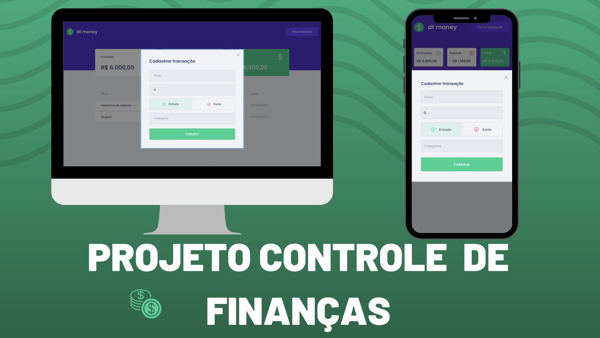

<h1 align="center">Dt Money</h1>

<br />

<p align="center">
  
</p>

<br />

## Descrição

Projeto feito em ReactJs, api simulada com miragejs, projeto para controle de finanças pessoais.

<p align="center">
  
</p>

<p>-------------</p>

<p align="center">
  
</p>

  - Projeto Front End esta com deploy na Netlify [clique aqui](https://glittery-bunny-77da3e.netlify.app/)

## 🚀 Instalação

Clone o projeto na sua máquina com Vs Code

```bash
$ git clone https://github.com/ramomOliveira/dtMoney.git
$ cd vh
$ code .
```


Para iniciá-lo, siga as etapas abaixo:

```bash
#instalar as dependências
$ yarn 


#iniciar o projeto
$ yarn dev #para rodar em desenvolvimento
```

</br>

## 🧪 Tecnologias

| Tecnologia            | Versão            |
| --------------------- | ----------------- |
| Axios                 | `0.27.2`          |
| MirageJs              | `0.1.45`          |
| Polished              | `18.1.0`         |
| ReactJs               | `12.1.6 `         |
| React-modal           | `3.15.1`          |
| Styled-components     | `5.3.5`          |
| Typescript            | `4.4.2`          |

<br />


- Obs: O projeto foi feito simulando uma api com axios e miragejs, então na versão online nao irar funcionar o CRUD.